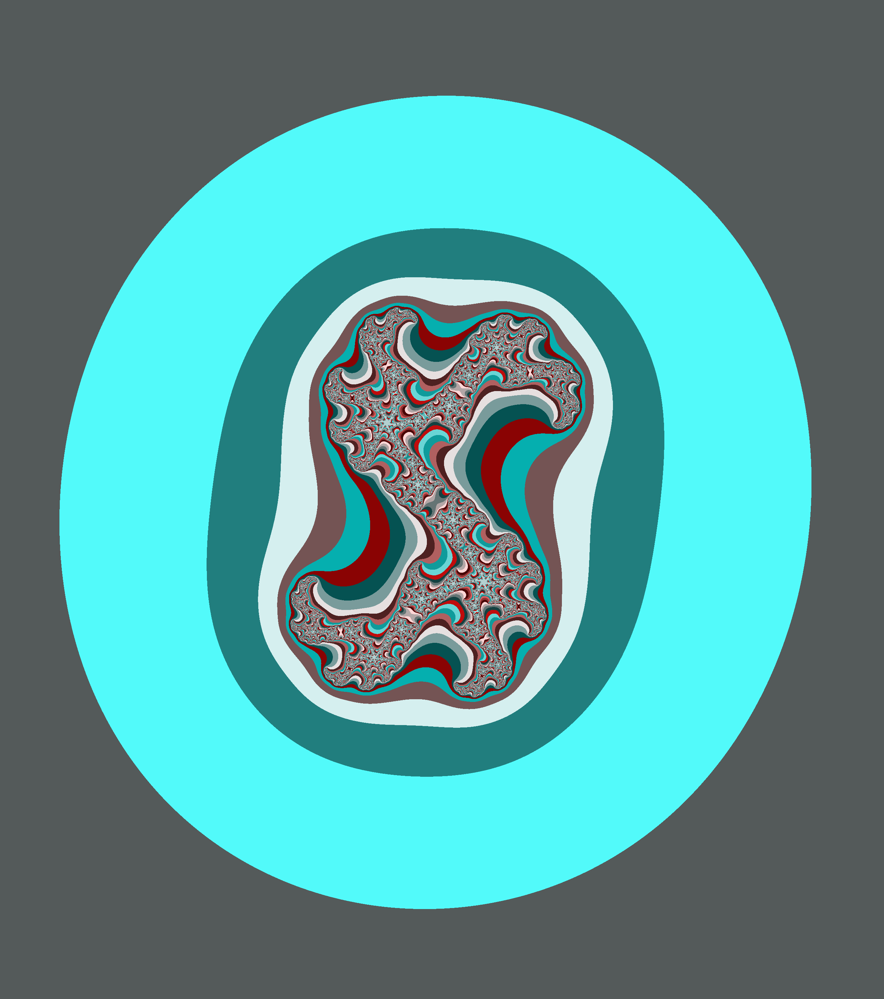

# Complex set art

Generate artistic Julia set images and save them to image format.




## Usage

```bash
// download package
go get -u github.com/bartolomej/complex-set-art

// move to project root
cd ~/go/src/github.com/bartolomej/complex-set-art

// run example render
go run *.go default-image
```

Julia set is generated using a function of a complex domain: `Z = Z^2 + C` <br>
All generated files are saved at `github.com/bartolomej/complex-set-art/out/`.

You can pass parameters to renderer in 3 ways:
- run without any arguments (default params) `go run *.go` or `go run *.go default-image`
- pass 4 arguments via cli
- define configurations in a file and run with


### CLI

Arguments syntax:
```bash
go run *.go <image-size> <Re(C)> <Im(C)> <generation-mode> <outputfile>
```

Example cli run command:
```bash
go run *.go 3000 0.37 -0.4 -i
```

### Configuration file
Create `renderers.json`  configuration file in root directory.<br>
Example configuration for generating static renders:
```json
[
  {
     "id": "zoomed-in",
     "resolution": 1000,
     "renderMode": "-t",
     "encoding": "png",
     "filename": "zoomed_in_-.61.52",
     "maxIterations": 80.0,
     "maxThreshold": 30.0,
     "static": {
       "centerX": -0.46,
       "centerY": 0.25,
       "axisSpan": 0.3,
       "mode": "-t",
       "realC": -0.61,
       "imagC": 0.52
     }
  }
]
```

Run above configuration with the following commands:
```bash
// pass config id as first param
go run *.go 1

// you can also override output filename by passing it as a second arg
go run *.go 1 out-test
```