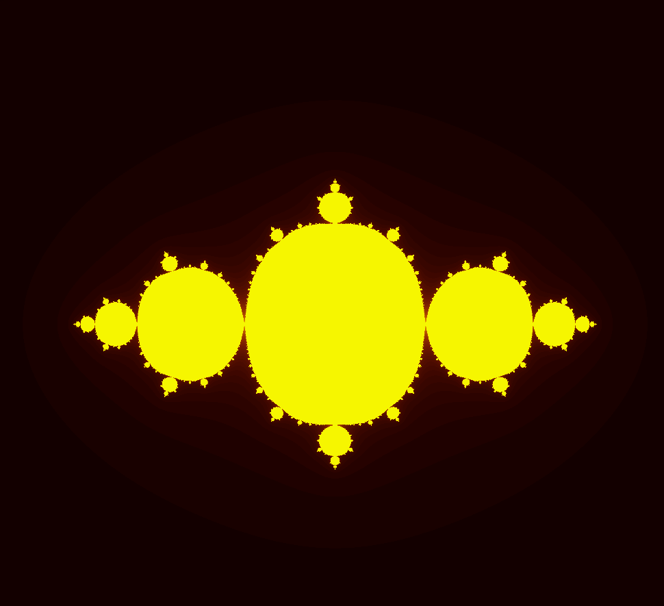
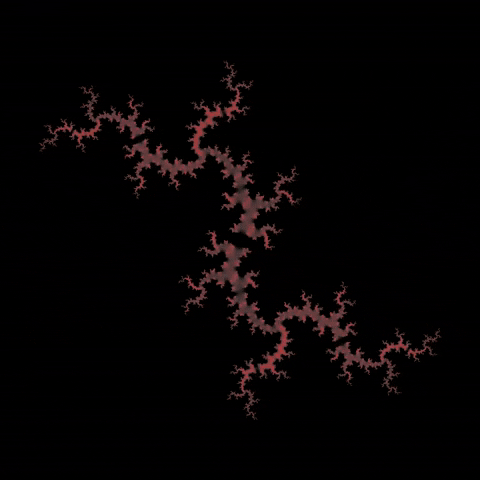

# Complex set art

Generate artistic images of Julia Set. More about [Julia Set](https://en.wikipedia.org/wiki/Julia_set).
I made this program while I was learning Go language for the first time.

I've also made another web based visualization of Julia set [here](https://bartolomej.github.io/julia-set).

| | | |
|:-------------------------:|:-------------------------:|:-------------------------:|
|  C = 0 + 0i |   C = -0.43 - 0.2i|
|  C = 0.61 + 0.52i |   C = -0.81 + 0.0i|
|  |   |

## Installation

Clone project in your project directory.
```bash
git clone github.com/bartolomej/julia-set && cd julia-set
```

## Usage

Requires a configured [Go environment](https://golang.org/doc/install).

### Default config

Run `default` scene configuration stored in `example.config.json`.
```
go run main.go
```

Basic usage syntax:
```bash
go run *.go <image-size> <Re(C)> <Im(C)> <output-file>
```

### Custom config

Create `config.json` scene configuration file in root directory.
Check out examples in `example.config.json` file.

Run custom scene configuration with the following syntax:
```bash
go run *.go <scene-id>
```